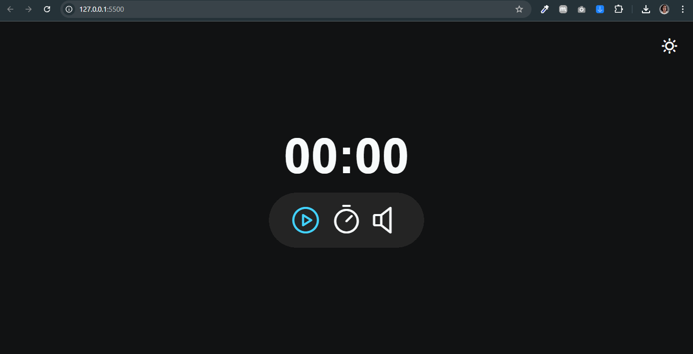

<h1 align="center" style="color: #34355b">Projeto: FocusTimer - Pomodoro</h1>

Explorer Stage 5

  <a href="#tecnologias" style="color: #525496">Tecnologias</a>&nbsp;&nbsp;&nbsp;|&nbsp;&nbsp;&nbsp;
  <a href="#aprendizado" style="color: #525496">Principais aprendizados</a>&nbsp;&nbsp;&nbsp;|&nbsp;&nbsp;&nbsp;
  <a href="#projeto" style="color: #525496">Projeto</a>&nbsp;&nbsp;&nbsp;|&nbsp;&nbsp;&nbsp;
  <a href="#como-executar" style="color: #525496">Como executar</a>&nbsp;&nbsp;&nbsp;|&nbsp;&nbsp;&nbsp;
  <a href="#licença" style="color: #525496">Licença</a>

 
<h2 style="color: #34355b">Acesse o projeto através de: 
  <a href="https://focus-timer.surge.sh/"
    target="_blank"
    style="color: #525496; 
      opacity: 0.9; 
      font-style: italic; 
      font-weight: bold; 
      text-decoration: underline; 
      transition: color 0.3s ease, border-bottom-color 0.3s ease;"
  >
    FocusTimer
  </a>
</h2>

 

  

<h2 id="tecnologias" style="color: #34355b">🚀 Tecnologias</h2>

Esse projeto foi desenvolvido com as seguintes tecnologias:

- HTML
- CSS
- JavaScript
- Phosphor Icons

<h2 id="aprendizado" style="color: #34355b"> 📃 Principais aprendizados:</h2>

- Manipulação do DOM com JavaScript para criar um timer interativo.
- Implementação de funcionalidades de controle de tempo (play, pause, reset).
- Criação de um modo claro/escuro (toggle mode).
- Integração de ícones usando a biblioteca Phosphor Icons.
- Uso de módulos JavaScript para melhor organização do código.

<h2 id="projeto" style="color: #34355b">💻 Projeto</h2>

O "FocusTimer - Pomodoro" é uma aplicação web que implementa a técnica Pomodoro para gerenciamento de tempo. Ele oferece um timer configurável, controles de play/pause, reset, e a opção de tocar música de fundo. Além disso, possui um modo claro/escuro para melhor experiência do usuário.

<h2 id="como-executar" style="color: #34355b">🔖 Como executar</h2>

1. Clone o repositório para o seu ambiente local.
2. Abra o arquivo `index.html` no seu navegador preferido.
3. Certifique-se de que todos os arquivos (HTML, CSS, JavaScript) estão na estrutura de pastas correta.

<h2 id="licença" style="color: #34355b">📝 Licença</h2>

Esse projeto está sob a licença MIT.